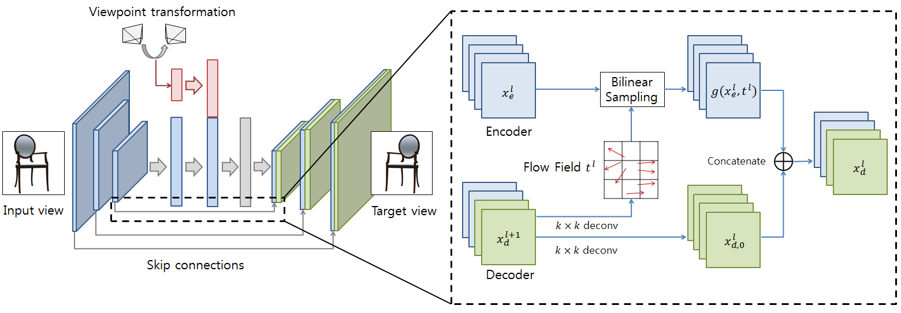
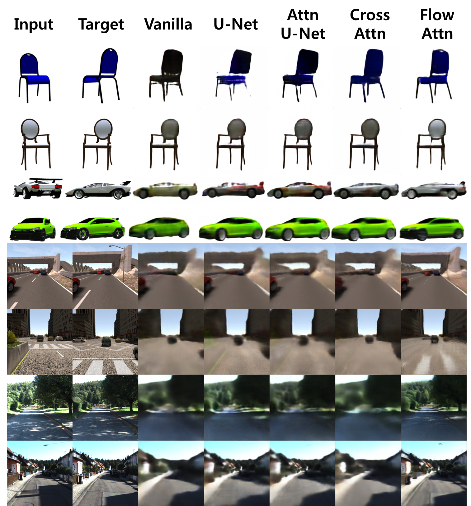

# Novel View Synthesis with Skip Connections

This repository is the official implementation of "Novel View Synthesis with Skip Connections".

## Requirements
You need Tensorflow 1.14 and Keras 2.2.4.

## Dataset
The dataset is processed from [4] ([github](https://github.com/shaohua0116/Multiview2Novelview)).
Our processed dataset can be downloaded from here. (6GB)
After unzip, put all numpy files into `numpy_data` folder.

## Skip connections with different attention strategies.
Because novel view synthesis includes severe geometric change,
traditional U-Net structure doesn't work well.
Here, we tested several different skip connection/attention strategies on basic two modules,
*pixel generation* [1] and *appearance flow* [2].
* Vanilla : No skip connection.
* U-Net : Simple U-Net structure with skip connection.
* Attn U-Net : Skip connection with attention mechanism from [3].
* Cross Attn : Skip connection with cross attention between input/output hidden layers.
* Flow Attn : Flow based hard attention. Figure is on below.

## Result on Pixel Generation
Flow based hard attention gave the best result.

| Method     | Car     |         | Chair   |         | Synthia |         | KITTI   |         |
|------------|---------|---------|---------|---------|---------|---------|---------|---------|
|            | L1      | SSIM    | L1      | SSIM    | L1      | SSIM    | L1      | SSIM    |
| Vanilla    | 0.0332  | 0.8910  | 0.0622  | 0.8535  | 0.0599  | 0.7324  | 0.0947  | 0.6681  |
| U-Net      | 0.0327  | 0.8935  | 0.0623  | 0.8559  | 0.0544  | 0.7521  | 0.0838  | 0.6842  |
| Attn U-Net | 0.0330  | 0.8926  | 0.0629  | 0.8550  | 0.0548  | 0.7575  | 0.0835  | 0.6870  |
| Cross Attn | 0.0322  | 0.8961  | 0.0614  | 0.8573  | 0.0600  | 0.7331  | 0.0969  | 0.6659  |
| Flow Attn  | 0.0259  | 0.9091  | 0.0499  | 0.8725  | 0.0512  | 0.7597  | 0.0776  | 0.6939  |

## Result on Appearance Flow
Reducing number of skip connection from outer layer seems to be a bit helpful.

| Method     | N_s | Car     |         | Chair   |         | Synthia |         | KITTI   |         |
|------------|-----|---------|---------|---------|---------|---------|---------|---------|---------|
|            |     | L1      | SSIM    | L1      | SSIM    | L1      | SSIM    | L1      | SSIM    |
| Vanilla    | -   | 0.0256  | 0.9168  | 0.0448  | 0.8898  | 0.0580  | 0.7372  | 0.0931  | 0.6470  |
| U-Net      | 4   | 0.0258  | 0.9148  | 0.0499  | 0.8798  | 0.0596  | 0.7139  | 0.0916  | 0.6286  |
|            | 3   | 0.0248  | 0.9176  | 0.0418  | 0.8922  | 0.0585  | 0.7227  | 0.0902  | 0.6326  |
|            | 2   | 0.0247  | 0.9177  | 0.0417  | 0.8923  | 0.0569  | 0.7248  | 0.0906  | 0.6379  |
|            | 1   | 0.0250  | 0.9172  | 0.0413  | 0.8934  | 0.0565  | 0.7354  | 0.0932  | 0.6460  |
| Attn U-Net | 4   | 0.0246  | 0.9181  | 0.0444  | 0.8895  | 0.0580  | 0.7172  | 0.0902  | 0.6349  |
|            | 3   | 0.0245  | 0.9188  | 0.0423  | 0.8923  | 0.0564  | 0.7256  | 0.0894  | 0.6383  |
|            | 2   | 0.0245  | 0.9191  | 0.0411  | 0.8942  | 0.0561  | 0.7272  | 0.0913  | 0.6460  |
|            | 1   | 0.0251  | 0.9172  | 0.0403  | 0.8952  | 0.0559  | 0.7337  | 0.0922  | 0.6470  |
| Flow Attn  | 4   | 0.0251  | 0.9172  | 0.0431  | 0.8910  | 0.0612  | 0.7060  | 0.0888  | 0.6458  |
|            | 3   | 0.0246  | 0.9181  | 0.0430  | 0.8904  | 0.0573  | 0.7221  | 0.0887  | 0.6454  |
|            | 2   | 0.0248  | 0.9176  | 0.0415  | 0.8933  | 0.0554  | 0.7372  | 0.0885  | 0.6471  |
|            | 1   | 0.0250  | 0.9175  | 0.0415  | 0.8936  | 0.0563  | 0.7356  | 0.0923  | 0.6482  |
| Cross Attn | 3   | 0.0252  | 0.9181  | 0.0448  | 0.8890  | 0.0580  | 0.7352  | 0.0937  | 0.6448  |
|            | 2   | 0.0254  | 0.9173  | 0.0453  | 0.8884  | 0.0576  | 0.7372  | 0.0930  | 0.6459  |
|            | 1   | 0.0254  | 0.9176  | 0.0450  | 0.8887  | 0.0577  | 0.7363  | 0.0933  | 0.6459  |

## Qualitative Result on Pixel Generation
Following figure is a qualitative result for pixel generation modules with 
different strategies.
There wasn't big difference on appearance flow models.

## References
[1] Tatarchenko, Maxim, Alexey Dosovitskiy, and Thomas Brox. "Multi-view 3d models from single images with a convolutional network." European Conference on Computer Vision. Springer, Cham, 2016.

[2] Zhou, Tinghui, et al. "View synthesis by appearance flow." European conference on computer vision. Springer, Cham, 2016.

[3] Oktay, Ozan, et al. "Attention u-net: Learning where to look for the pancreas." arXiv preprint arXiv:1804.03999 (2018).

[4] Sun, Shao-Hua, et al. "Multi-view to novel view: Synthesizing novel views with self-learned confidence." Proceedings of the European Conference on Computer Vision (ECCV). 2018.